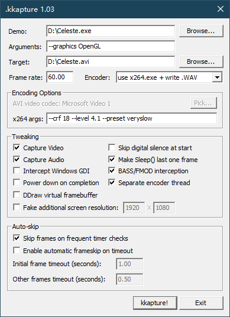

# .kkapture

.kkapture is a small tool that produces video+audio captures of fullscreen apps (usually demos). Unlike FRaPS, it does not run in realtime; instead, it makes the demos run at a given, fixed framerate you can specify beforehand. In other words, .kkapture can make 60fps video captures of any demo your computer can run, even if each frame takes several seconds to render.

## Why would someone want this?
For Windows demos, it is usually not much work to add a video writer to your program. However, that has to be done by the authors; the nice part about .kkapture is that it is general enough to work with a wide variety of demos, automatically. If you write demos yourself and .kkapture is able to handle your demo without problems, well, you've just saved yourself the work of coding a video writer yourself.

The main application area is when you want to make several quality video captures of different demos in a short period of time, without having to contact each of the coders. Production of demo DVDs or pre-cut demoshows is a prime example.

## How did it come to be?
Well, rather simple story; I was rather annoyed by the generally so-so video quality of the 2004 scene.org awards, mostly caused by repeated frame-rate changes (first FRAPS which captures at whatever rate the demo runs, then video encoding, then playback on a computer with a different refresh rate). The fixed framerate capturing should be able to get rid of most of these problems, by simply avoiding the necessity of framerate conversions altogether.

## How does it work?
If you want the gory details, just look at the provided source code. Here's a short executive summary: .kkapture works by hooking certain graphics api functions to capture each frame just as it is presented on screen. All popular ways of getting time into the program are wrapped aswell - timeGetTime, QueryPerformanceCounter, you name it. This is necessary so .kkapture can make the program think it runs at a fixed framerate (whatever you specified). The most tricky part is audio, because it doubles as both capture signal and sync source. .kkapture provides a custom (and very dumb) DirectSound implementation that emulates an actual soundcard again updating with your exact specified framerate. WaveOut support is presen too, and in recent versions, .kkapture also intercepts some popular sound systems directly to make sure the correct time is reported back to the application.

## How do I use it?
Well, download it, start kkapture.exe, specify demo/video file name and framerate, hit "kkapture!", select your codec of choice and that should be it :). [Rarefluid](http://wurstcaptures.untergrund.net/capture_kkapture.html) has written an article that explains some of the finer points if you want to create high-quality video captures.

There's also some checkboxes that turn on certain workarounds. The defaults usually work best, but if you're dealing with a picky demo, try playing around with the flags a bit, it might help.

### Rarefluid's guide

Choose the demo you want to capture. kkapture should work with most demos using DirectDraw surfaces, Direct3D8/9/10 or OpenGL, fullscreen and windowed. Read the compatibility list file "working_demos.txt" that comes with kkapture for useful hints.

If a demo doesn't work (black screen at start or at the end or nothing captured):

* Take a look at the "kkapturelog.txt" log file that has been created in the folder you ran the demo from. If there are messages about directshow errors try choosing a different compression codec (AVI Enconding options->Pick) and/or a different encoder (Encoder->".AVI, VfW segmented" should usually work, but has a 2GB segment limit. You'll need to combine the files afterwards.)
* You can also try changing the "Tweaking" options. It often helps to use the "New startup interception".
* If you can't capture a demo in fullscreen mode, try windowed mode (if available) and vice-versa.
* If you have a demo that doesn't correctly shut down at the end while kkapturing it the video will most likely be broken. Try pressing right alt at the end. kkapture should terminate then and close the avi file properly. If that doesn't work, but the demo offers a loop mode you can work around the problem by using this and pressing ESC at the right moment...
* When capturing some demos (e.g. Heaven7) with kkapture the demo closes the window, but still executes and kkapture terminates the hooking thread (so CTRL-BREAK is NOT working). The video won't be correctly written, 'cause kkapture can't properly close the file. You'll need to kill the demo process with the task manager...
* If this happens with a file that has multiple parts (using the VFW-encoder), you won't be able to concat the files, because of the missing AVI/RIFF header in the last file. The good thing is that you can fire up your favorite hex-editor (HxD is quite good) and copy the AVI/RIFF header (Offset 0, Lenght 2048 Bytes), from a working file you captured, to the non-working one. When you open it with Virtualdub then (set the error mode to "conceal"), it'll complain about missing indices, but you should be able to process the video.
* Demos of the 1999-2001 era often use GDI and DirectDraw in a strange combination. Try checking the "Intercept Windows GDI" box for those.
* Some demos created in that time also rely on the drawing area having a pitch of the bufferWidth * nrOfBytesPerPixel. This is not always true, as there can be a stride (empty area) at the end of each buffer line. If your image comes out somehow shifted or totally screwed up, try checking the "DDraw virtual framebuffer" option.

### x264 Encoder
If you using x264 encoder, you will get `xxx.264` and `xxx.wav` files.
Drag and drop the `xxx.264` file onto the `tools/convert_264+wac_to_mp4.bat` file will merge it with the `xxx.wav` file and output the `xxx.mp4` file.

## Where can I get it?
Latest release: https://github.com/DemoJameson/kkapture/releases

Older versions: http://www.farbrausch.de/~fg/kkapture